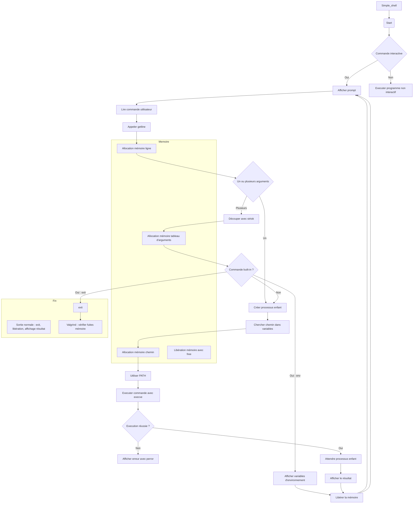

# Holbertonschool-simple_shell  

# :dart: C - printfsimple_shell
Ce programme affiche un prompt si la commande est interactive, puis execute l'action demandé par l'utilisateur. 
Si la commande est non interactive, elle execute le programme demandé par l'utilisateur via le programme

##  :cyclone: Commande qui permet la compilation :
gcc -Wall -Werror -Wextra -pedantic -std=gnu89 *.c -o hsh
* gcc : est utilisé pour compiler notre code
* Wall - Wextra - Werror -pedantic -std=gnu89 : Le code respecte le standard C89 et tous les avertissements lors de la compilation sont activés (si toutes les erreurs ne sont pas corrigées, alors la compilation ne fonctionnera pas)
* *.c, signifie que la compilation va s'executer sur l'ensemble des fichiers avec une extension ".c".

Après la compilation, un fichier hsh est créé. Et pour avoir notre/nos valeurs de retour, il faudra l'exécuter sur le terminal via la commande ./hsh

 ## :triangular_flag_on_post: Exigences :
- éditeurs autorisés: vi, vim, emacs
- Tous les fichiers sont compilés sur Ubuntu 20.04 LTS
- Le code utilise le style Betty
- Il ne faut pas de fuites de mémoires pour éviter des erreurs
- Notre structure, ainsi que les prototypes de toutes les fonctions sont inclus dans le main.h

## :computer: Installation :
Sur Linux et macOS, utiliser directement un terminal ou sur windows, utiliser PowerShell et insérer ce code :

git clone https://github.com/AnneCecile2935/holbertonschool-printf.git/utilisateur

## :link: Flowchart :

### :paperclip: Contenu du repo :

| Fichiers               | Description |
|------------------------|------------------------------------------------------------------------------------------------------------------------|
| _putchar.c             | fonction qui permet d'afficher un caractère                                                                          |
|main.h                |fichier header qui contient les prototypes de fonctions et la structure relieur pour les spécificateurs|
|_printf.c              |fichier source, avec l'appel de toutes les fonctions spécificateurs et retourne une valeur suivant les conditions respectées|
|function_char.c |       fichier source, qui contient une fonction pour afficher un caractère|
|function_integer.c |fichier source, qui contient une fonction pour afficher un entier + ou - et la longueur d'une chaîne de caractère en nombre|
|function_pourcentage.c|fichier source, qui contient une fonction pour afficher un pourcentage|
|function_strings.c |fichier source, qui contient une fonction pour afficher une chaîne de caractère|
|a.out |fichier compilé qui contient le résultat de notre code|
|main.c |fichier source, qui sert d'exemple pour montrer que le résultat entre la commande printf et notre fonction _printf ont le même retour|
|man_3_printf| Manuel de notre fonction _printf|
|README.md| Explication et installation de la fonction|

#### :mag_right: Comment accéder à la man page (via une commande d'exécution) :

	man ./man_3_printf

####  :ballot_box_with_check: Exemples de sortie :
_printf("Negative:[%d]\n", -762534); :arrow_right: -762534

_printf("%c%cth %s%s a%cg%s: Y%sou %s no%ching%s Snow.%c", 'W', 'i', "some ", "more", 'r', "s", "", "know", 't', ", Jon", '\n'); :arrow_right: With some more args: You know nothing, Jon snow.

_printf("Percent:[%%]\n"); :arrow_right: %

thought = _printf("Hello Samourai\n"); :arrow_right: Hello Samourai

_printf("Length:%d\n", thought); :arrow_right: Lenght:15

#### :warning: Failles mémoire détectés ?
On détecte une fuite de mémoire avec l'utilisation de Valgrind, un outil notamment utile pour mettre en évidence des potentiels fuite de mémoire.
- on compile avec gcc.
- Valgrind ./hsh ! = total heap usage : allocs, frees, 1,024 bytes allocated.

Après l'utilisation de Valgrind, on peut voir que nous n'avons pas de fuite mémoire car notre allocation mémoire statique retiens bien une valeur retour.

<h3 align="left">Languages and Tools:</h3>

  
</a>  
