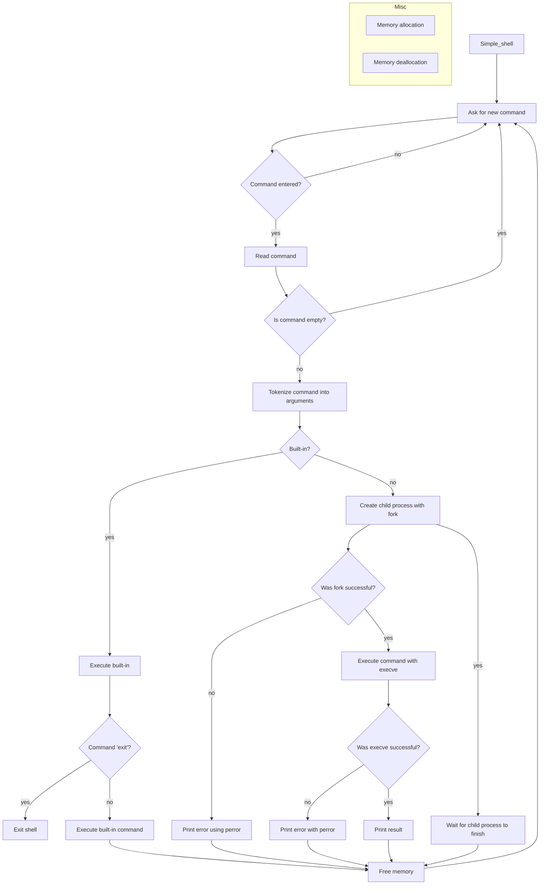

<div align="center"></div>

---

# 🐚 Simple Shell - README

## 📑 Table of Contents

- [📚 Resources](#-resources)
- [🎯 Learning Objectives](#-learning-objectives)
- [📌 Requirements](#-requirements)
- [🧾 More Info](#-more-info)
- [✅ Allowed Functions](#-allowed-functions)
- [🛠️ Compilation](#-compilation)
- [🧪 Testing](#-testing)
- [🧪 Checks](#-checks)
- [📊 Flowchart](#-flowchart)
- [👥 Authors](#-authors)

---

## 📚 Resources

### 📖 Read or Watch

- Unix shell
- Thompson shell
- Ken Thompson
- Everything you need to know to start coding your own shell (concept page)

### 💡 man or help

- `sh` (Run `sh` as well)

---

## 🎯 Learning Objectives

By the end of this project, you should be able to explain to anyone, without using Google:

### 🧠 General

- Who designed and implemented the original Unix operating system
- Who wrote the first version of the UNIX shell
- Who invented the B programming language (the direct predecessor to the C programming language)
- Who is Ken Thompson
- How does a shell work
- What is a pid and a ppid
- How to manipulate the environment of the current process
- What is the difference between a function and a system call
- How to create processes
- What are the three prototypes of `main`
- How does the shell use the `PATH` to find programs
- How to execute another program with the `execve` system call
- How to suspend the execution of a process until one of its children terminates
- What is EOF / "end-of-file"

---

## 📌 Requirements

### ⚙️ General

- Allowed editors: `vi`, `vim`, `emacs`
- All files compiled on Ubuntu 20.04 LTS using gcc
- Compilation options: `-Wall -Werror -Wextra -pedantic -std=gnu89`
- All files should end with a new line
- A `README.md` file is mandatory at the root of the project
- Code must follow the Betty style (checked with `betty-style.pl` and `betty-doc.pl`)
- No memory leaks allowed
- No more than 5 functions per file
- Header files must be include-guarded
- Use system calls only when necessary

### 🧑‍💻 GitHub

- One project repository per group
- Forking or cloning before the deadline may result in a 0% score

---

## 🧾 More Info

### 🖨️ Output

Your shell must have the same output as `/bin/sh` (error messages included), except for the name of the program printed in errors, which must match `argv[0]`.

#### ⚠️ Example of error with sh

```sh
julien@ubuntu:/# echo "qwerty" | /bin/sh
/bin/sh: 1: qwerty: not found
```

#### ✅ Same error with your program hsh

```sh
julien@ubuntu:/# echo "qwerty" | ./hsh
./hsh: 1: qwerty: not found
```

---

## ✅ Allowed Functions

- All functions from `string.h`
- `access`, `chdir`, `close`, `closedir`
- `execve`, `exit`, `_exit`, `fflush`, `fork`, `free`
- `getcwd`, `getline`, `getpid`, `isatty`, `kill`, `malloc`
- `open`, `opendir`, `perror`, `printf`, `fprintf`, `vfprintf`
- `sprintf`, `putchar`, `read`, `readdir`, `signal`
- `stat` (__xstat), `lstat` (__lxstat), `fstat` (__fxstat)
- `strtok`, `wait`, `waitpid`, `wait3`, `wait4`, `write`

---

## 🛠️ Compilation

Compile your shell using:

```sh
gcc -Wall -Werror -Wextra -pedantic -std=gnu89 *.c -o shell
```

---

## 🧪 Testing

### 🖥️ Interactive Mode

```sh
julien@ubuntu:/# ./hsh
($) /bin/ls
hsh main.c shell.c
($)
($) exit
julien@ubuntu:/#
```

### 📤 Non-interactive Mode

```sh
julien@ubuntu:/# echo "/bin/ls" | ./hsh
hsh main.c shell.c test_ls_2
```

```sh
julien@ubuntu:/# cat test_ls_2
/bin/ls
/bin/ls
```

```sh
julien@ubuntu:/# cat test_ls_2 | ./hsh
hsh main.c shell.c test_ls_2
hsh main.c shell.c test_ls_2
```

---

## 🧪 Checks

A checker will be released before the deadline. All students are encouraged to collaborate to build a test suite for normal and edge cases.

After the deadline, you must fork the repo (if it's not on your GitHub account) to be g## Installation Steps

## 📋 Installation Guide

### 1. Clone the Repository

```bash
   git clone https://github.com/AnneCecile2935/holbertonschool-simple_shell.git
   cd holbertonschool-simple_shell
```

---

#### 2. Prepare the Installation Script

```bash
chmod +x install_man_page.sh
```

#### 3. Run the Installation Script

```bash
sudo ./install_man_page.sh
```

#### Verifying Installation

```bash
man myshell
```

### Troubleshooting

- Ensure necessary permissions
- Verify script location
- Check `mandb` installation

### Uninstallation

```bash
sudo rm /usr/local/share/man/man1/myshell.1.gz
sudo mandb
```

---

## 📖 Manual - How to use the man page

To view the manual page for this shell project, use the following command in your terminal:

```bash
man shell
```
✅ Make sure the man_shell1 file is located at the root of the project directory.

This manual page provides:

A description of the shell

Compilation instructions

Usage guidelines

List of built-in commands (exit, env, cd, etc.)

Examples of shell usage

## 📊 Flowchart



---

## 👥 Authors

This project was created and maintained by:

- [AnneCecile2935](https://github.com/AnneCecile2935)
- [BenoitMain](https://github.com/BenoitMain)
